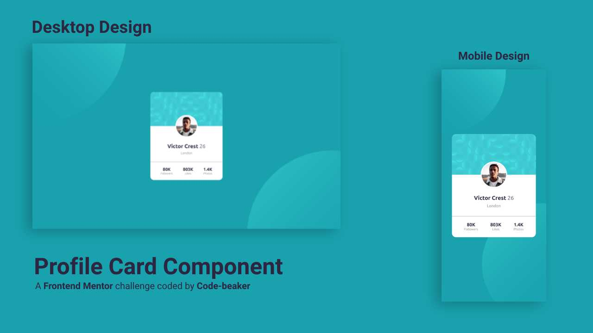

# Profile Card Component Solution 🎉

This is a solution to the **Profile Card Component** challenge from [Frontend Mentor](htt[ps://frontendmentor.io])

## Preview 👀

Mockup image representing the preview for the solution.

## Built With 🛠️

- Visual Studio Code
- HTML
- CSS
- Vite

## What I learned 📚

I learned to make use of `position: absolute` in positioning the profile image and also for the divider. Used responsive `clamp()` values for typography and CSS custom properties to make my code better and easier to use.

Used `npm run build` to make a production build of my project that is minified for better performance by Vite.

## Links 🔗

- GitHub Repository: **[Visit ▶️](https://github.com/Code-Beaker/profile-card-code-beaker)**
- Netlify Deploy: **[Visit ▶️](https://profile-card-code-beaker.netlify.app/)**

## Thank you 🙏

Thank you for checking out this solution. If you wish to see all the challenges that I have completed, visit my **[Frontend Mentor profile](https://frontendmentor.io/profile/Code-Beaker)**.
